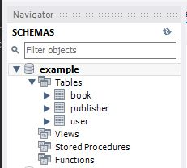
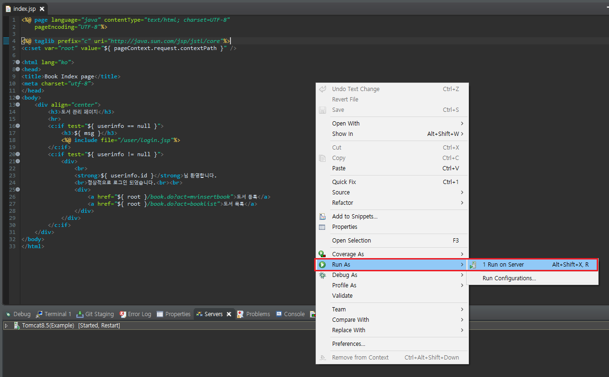
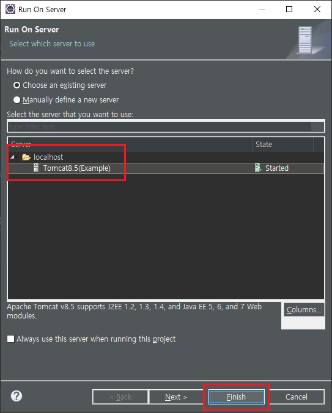
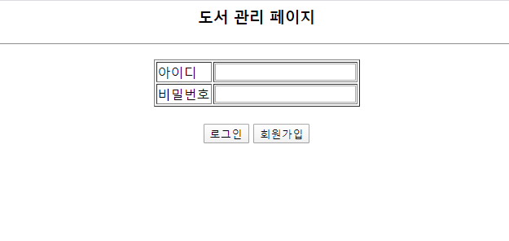

# JAVA Servlet 기초

<br><br>


## 개발환경 (Development environment)

> Window10 (64bit)

- CPU : Intel(R) Core(TM) i5-6600 CPU @ 3.30GHz
- RAM : 16.0GB

> JAVA SDK

- 1.8.0_221

> MySQL

- 8.0.19

> Apache Tomcat

- 8.5.54

> Tool IDE

- Eclipse
- MySQL WorkBench

<br><br>


## 어떻게 실행할까? (How to run?)

### 1. 라이브러리 추가

본 프로젝트를 실행해보기 위해서는 2가지 라이브러리가 필요

[JSTL, MySQL Connector](https://github.com/msnodeve/java-backend-example/tree/master/WebContent/WEB-INF/lib) (본 프로젝트를 다운로드 하면 내부에 포함되어 있음)

JSTL 다운로드 링크 주소 : [https://mvnrepository.com/artifact/javax.servlet/jstl](https://mvnrepository.com/artifact/javax.servlet/jstl)

MySQL Connector 다운로드 링크 주소 : [https://dev.mysql.com/downloads/connector/j/](https://dev.mysql.com/downloads/connector/j/)

<br>


### 2. DB 구축

먼저 'example' DB를 생성

```mysql
create database example;

use example;
```


- ./res/createSchema.sql 파일 위치로 이동
- [https://github.com/msnodeve/java-backend-example/blob/master/res/createSchema.sql](https://github.com/msnodeve/java-backend-example/blob/master/res/createSchema.sql)

위 2 가지방법으로 아래와 같은 SQL 스키마를 볼 수 있음

```mysql
-- 도서
CREATE TABLE book (
	isbn        INT          NOT NULL, -- 도서 ID
	pno         INT          NOT NULL, -- 출판사 ID
	title       VARCHAR(50)  NULL,     -- 제목
	author      VARCHAR(30)  NULL,     -- 저자
	description VARCHAR(100) NULL,     -- 설명
	price       INT          NULL,     -- 가격
	date        DATE         NULL      -- 출판일
);

-- 도서
ALTER TABLE book
	ADD CONSTRAINT PK_book -- 도서 기본키
		PRIMARY KEY (
			isbn, -- 도서 ID
			pno   -- 출판사 ID
		);

-- 출판사
CREATE TABLE publisher (
	pno       INT          NOT NULL, -- 출판사 ID
	publisher VARCHAR(50)  NULL,     -- 출판사 이름
	address   VARCHAR(100) NULL      -- 주소
);

-- 출판사
ALTER TABLE publisher
	ADD CONSTRAINT PK_publisher -- 출판사 기본키
		PRIMARY KEY (
			pno -- 출판사 ID
		);

-- 사용자
CREATE TABLE user (
	id      VARCHAR(30)  NOT NULL, -- 사용자 ID
	pw      VARCHAR(30)  NULL,     -- 사용자 PW
	email   VARCHAR(30)  NULL,     -- 이메일
	address VARCHAR(100) NULL,     -- 주소
	tel     VARCHAR(20)  NULL      -- 전화번호
);

-- 사용자
ALTER TABLE user
	ADD CONSTRAINT PK_user -- 사용자 기본키
		PRIMARY KEY (
			id -- 사용자 ID
		);

-- 도서
ALTER TABLE book
	ADD CONSTRAINT FK_publisher_TO_book -- 출판사 -> 도서
		FOREIGN KEY (
			pno -- 출판사 ID
		)
		REFERENCES publisher ( -- 출판사
			pno -- 출판사 ID
		);

ALTER TABLE `example`.`book` 
CHANGE COLUMN `isbn` `isbn` VARCHAR(30) NOT NULL ;

```

위 스키마를 생성하고 나면 다음과 같은 DB 구조를 확인 할 수 있음



<br>


## 3. Eclipse와 Tomcat 연동

링크를 통해 확인 : [https://all-record.tistory.com/49](https://all-record.tistory.com/49)

주의 : 본 프로젝트는 Tomcat v8.5 Server를 선택했음

<br>


## 4. Index 페이지를 실행

오른쪽 마우스를 누른뒤 다음 화면 처럼 실행



Server를 확인하고 Finish 버튼 클릭




<br><br>


## 실행화면

